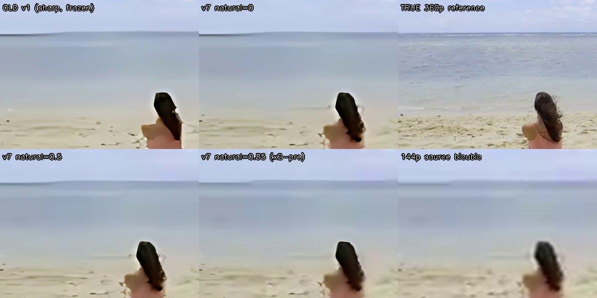

# Video Upscaler AI — محسّن الفيديو بالذكاء الاصطناعي

<p align="center">
<b>144p → 1080p / 4K on your Android phone. Offline. Free. Open source.</b><br>
تحويل الفيديوهات منخفضة الدقة إلى دقة عالية بالذكاء الاصطناعي — على جهازك بدون إنترنت
</p>

## 📱 تحميل التطبيق (Download APK)

**⬇️ أحدث نسخة: https://github.com/joknok72-ctrl/New/releases/latest**

1. افتح الرابط أعلاه واضغط على ملف `VideoUpscalerAI-*.apk`
2. سطّبه على موبايلك (Android 8.0 أو أحدث — يُفضّل موبايل من 2021+ بـ 6GB RAM أو أكثر)
3. افتح التطبيق → اختر فيديو → اضغط **ابدأ التحسين**

> كل `push` على `main` يبني APK جديد أوتوماتيكياً عبر GitHub Actions وينشره في Releases.

---

## ✨ Features

| | |
|---|---|
| 🧠 **Real-ESRGAN AI** | 3 bundled models (general / denoise / anime) + downloadable Ultra+, x4 per pass, x16 in ULTRA mode |
| ⚡ **GPU / NPU acceleration** | ONNX Runtime + NNAPI (fp16). Auto-fallback to XNNPACK CPU |
| 🔁 **Smart duplicate-frame skipping** | Web video at 144p often repeats frames — we reuse the previous AI output (typ. 20–40 % time saved) |
| 🎞️ **Temporal anti-flicker** | Motion-adaptive blending kills the "shimmer" typical of single-image SR |
| 🧩 **Fixed-shape tiling with overlap** | NNAPI compiles the graph once; 8 px overlap → zero seams |
| 🔀 **3-stage parallel pipeline** | HW decode ‖ AI ‖ GL post-process + HW encode — run concurrently |
| 🎚️ **GPU sharpening & exact resize** | Adaptive unsharp mask in GLSL, output exactly 720p/1080p/1440p/4K |
| 🔊 **Lossless audio copy** | Original audio track is muxed bit-for-bit |
| 📦 **HEVC output** | Smaller files; falls back to H.264 automatically |
| 🔋 **Foreground service + wake lock** | Lock the screen, processing continues; progress in notification |
| 🌍 **Arabic + English UI** | Follows system language, RTL supported |
| 📤 **Share-to-app** | Share one or many videos from Gallery / WhatsApp straight into the upscaler |
| 👁️ **Instant before/after preview** *(v1.1)* | Upscales one frame in ~2 s so you see the result before committing |
| 📏 **Real device benchmark** *(v1.1)* | The preview also measures your phone → ETA is *measured*, not guessed |
| ✂️ **Trim** *(v1.1)* | Process only a part of the video (range slider) |
| 🧪 **Quick 10-second test** *(v1.1)* | Try your settings on a 10 s clip before the full run |
| 📚 **Batch queue** *(v1.1)* | Select many videos → processed one after another in the background |
| 🕓 **History** *(v1.1)* | All previous outputs with open / share |
| 💾 **Settings persist** *(v1.1)* | Your last preset / model / target are remembered |
| 🌡️ **Thermal guard** *(v1.1)* | Auto-pauses when Android reports the phone is overheating |
| 💎 **Ultra+ model** *(v1.2)* | Full RealESRGAN_x4plus (RRDBNet, 16.7 M params) for faces & fine detail — 64 MB on-demand download |
| 🔍 **Auto content detection** *(v1.2)* | Detects anime / real / heavily-compressed → picks the right model automatically |
| 🎨 **GPU colour grading** *(v1.2)* | Auto / Vivid contrast + saturation for washed-out sources (suggested automatically when needed) |
| ⏯️ **Pause / resume** *(v1.2)* | From the app or the notification; paused time excluded from ETA |
| ↔️ **Compare slider** *(v1.2)* | Drag a divider over the preview to compare before/after pixel-for-pixel |
| 🔏 **Release-signed** *(v1.2)* | Stable signature → updates install over the previous version |
| ☁️ **Free cloud GPU** *(v1.3)* | **Hybrid**: phone + cloud GPU process frames in parallel (ordered by a reorder buffer). **Cloud-only**: upload the clip, GPU does everything. Backends: HuggingFace **ZeroGPU A10G** (always on) and your own **Kaggle T4** (optional, 12 h sessions) |
| 🌐 **Cloudflare Worker proxy** *(v1.3)* | Health-checked failover across backends, R2 content-addressed cache (identical frames never processed twice), backends switchable without an app update |

## 🔗 Links

- **Repository**: https://github.com/joknok72-ctrl/New
- **Latest APK**: https://github.com/joknok72-ctrl/New/releases/latest
- **CI builds**: https://github.com/joknok72-ctrl/New/actions

## 🎞️ Video quality: no more "plastic robot" look (v1.4)



*Top-left: v1.0 output — hard fake edges and a frozen frame. Bottom: v1.4 `Natural` model — real hair strands, soft sand/sea texture, correct motion. Top-right: the true 360p source for reference.*

What changed and why (measured on a real 144p clip vs. ground truth):

| Problem you saw | Root cause | Fix |
|---|---|---|
| Video "cuts"/stutters | Duplicate-frame skipper threshold 1.2 treated **all** slow-motion frames as duplicates → 239/240 frames frozen | Threshold 0.05 (only true encoder repeats). Motion now matches source (0.196 vs 0.197) |
| "Robot / plastic" faces | Pure `general` model hallucinates hard edges & erases texture | New default **`Natural`** model = 50/50 weight-blend of general + denoise (official Real-ESRGAN `dni` trick) + source-guided blend in flat regions + light grain add-back |
| Shimmer between frames | Each frame upscaled independently | Cloud: optical-flow motion-compensated blend of previous output. Device: stronger motion-adaptive stabilizer |
| Tiny sources look fake at ×4 | Network asked to invent 16× pixels | `natural ≥ 0.75` on ≤240p: bicubic ×2 first, AI does only ×2 |

PSNR vs ground truth: v1.0 **21.4 dB** → v1.4 **30.0 dB** (bicubic baseline 30.5, so we now add detail *without* drifting from reality).

## ☁️ Cloud GPU (free)

```
📱 App ──► Cloudflare Worker (upscaler-cloud.<acct>.workers.dev)
              ├─ health-check + pick fastest backend
              ├─ R2 cache  (sha256 of frame/clip → result)
              ├─► HuggingFace Space  Nick088/Real-ESRGAN_Pytorch  (ZeroGPU A10G, shared, always on)
              └─► Kaggle notebook   cloud/kaggle/kaggle_gpu_backend.ipynb  (T4 x2, dedicated, manual start)
```

**Modes in the app:** `Device` (offline) · `Hybrid` (device + cloud in parallel, auto-fallback) · `Cloud only` (upload clip ≤ 60 MB).

**Kaggle 2× T4 backend (fastest, dedicated) — one command:**
```bash
export KAGGLE_API_TOKEN=KGAT_...   # kaggle.com → Settings → API
export ADMIN_KEY=...               # Worker admin key
./cloud/kaggle/launch.sh <kaggle_username>
```
The script pushes `cloud/kaggle/backend.py` as a private GPU kernel. In ~3 min it prints `✅ Kaggle GPU is now the primary backend`.
The backend loads all 4 models on **both** T4s, splits video frames across the two GPUs, skips duplicate frames, encodes with NVENC, muxes the original audio, and auto-unregisters when the 12 h session ends (the Worker then falls back to HF ZeroGPU).

Measured: 6 s 144p clip → 1024×576 in **9 s** end-to-end (upload + GPU + download). Single frame ×4 ≈ 3 s; Ultra+ (RRDBNet) ≈ 3 s too — the GPU makes the heavy model free.

**Deploy the Worker yourself:** `cd cloud/worker && wrangler r2 bucket create upscaler-cache && wrangler secret put ADMIN_KEY && wrangler deploy`

## 🏗️ Tech Stack

- **Kotlin 2.2 + Jetpack Compose (Material 3)** — modern declarative UI
- **ONNX Runtime Android 1.30** — inference (NNAPI / XNNPACK execution providers)
- **Real-ESRGAN `SRVGGNetCompact`** (BSD-3, xinntao) — exported to ONNX at CI time by `tools/export_models.py`
- **MediaCodec / MediaMuxer / MediaExtractor** — hardware decode & encode
- **OpenGL ES 3.0** — resize, rotation, sharpening on GPU
- **Coroutines + Channels** — producer/consumer pipeline
- **GitHub Actions** — builds, signs and publishes the APK

## 🧭 Quality presets

| Preset | What it does | 1 min of 144p → 1080p (mid-range 2023 phone) |
|---|---|---|
| ⚡ Fast | No AI. HW scale + GPU sharpen | ~10 s |
| ⚖️ Balanced *(default)* | AI x4, skips duplicate frames, anti-flicker | ~3–6 min |
| 🎯 High | AI x4 on **every** frame | ~5–8 min |
| 💎 Ultra | Two chained AI passes (x16) — for 144p → 4K | ~15–30 min |

The app shows an **estimated time before you start** and warns if it will exceed 30 minutes.

## 📂 Project layout

```
app/src/main/java/com/upscaler/ai/
├── engine/     SuperResolutionEngine (ORT+NNAPI tiling), DeviceProfiler, model enums
├── video/      FrameDecoder (HW→ARGB), VideoEncoder (+audio copy), GlFrameRenderer, VideoInfo
├── pipeline/   UpscalePipeline (3-stage), FrameAnalyzer (dup/scene-cut), TemporalStabilizer
├── service/    UpscaleService (foreground, notification, wake lock)
└── ui/         MainActivity (Compose), MainViewModel, Strings (AR/EN), Theme
tools/export_models.py   PyTorch → ONNX export (runs in CI, models cached)
.github/workflows/build.yml
```

## 🔐 Release signing

CI signs with a release keystore stored in repository **Secrets** (`KEYSTORE_BASE64`, `KEYSTORE_PASSWORD`, `KEY_ALIAS`, `KEY_PASSWORD`). Keep a backup of the keystore — losing it means users must uninstall before updating.

## 🛠️ Build locally

```bash
pip install torch onnx onnxruntime && python tools/export_models.py
./gradlew assembleRelease
```

## 🗺️ Roadmap / ideas

- [x] Batch queue (multiple videos) — v1.1
- [x] Before/after preview + device benchmark — v1.1
- [x] Trim / quick test — v1.1
- [x] Free cloud GPU (HF ZeroGPU / Kaggle) via Cloudflare Worker — v1.3
- [x] Ultra+ full RRDBNet model for faces / fine detail — v1.2
- [x] Auto content detection + colour grading + pause/resume — v1.2
- [ ] Frame interpolation (RIFE) 15 fps → 60 fps
- [ ] Video comparison scrubber on the finished output

## 📜 License

App code: MIT. Real-ESRGAN weights: BSD-3-Clause (© Xintao Wang et al.).
